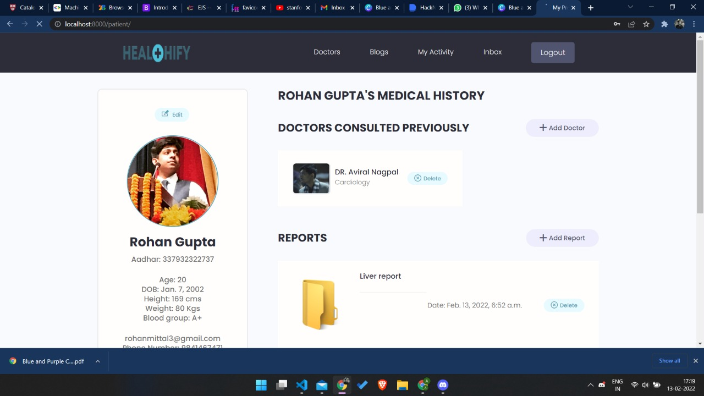

# Healthify

### Ideology 

Digitizing patient records and making them accessible to doctors via patient's aadhar number.
People with physical constraints can easily consult the best doctors without any hassle of travelling or going out.
Platform similar to a freelancing platform where patients can find verified doctors with best experience.

##### Youtube Video

https://youtu.be/jUek6LGziq0

## Walkthrough
Alan assistant- We have an AI assistant to cater to your needs like logging in, searching for doctors, seeing your activity profile and much more.

You will see the landing page and you can ask the assistant to login or signup, or you can simply press the buttons and sign up manually. 

### Home

After logging in you will se your profile and you can add your past prescriptions, and also see some lab reports is they are added. Using this page you can search for various other features
and use can also use our assistant for some common tasks.

### Doctors

When you click or ask alan about the doctors you will se a list of doctors matching your health problems. Here you can communicate with the doctor and book an appointment.

### Blogs

When you click or ask alan about the blogs you will se a list of blogs matching your health problems. Here you can click any blog and read it and also review it.

### Activity

When you click or alan about your activity you will se the my activity section. Here you can see your health card containting a qr code. A doctor can scan your qr code to see 
your health details which provides a fast solution for them. You can also see a tracking section in future which will tackle your daily day to day behaviour and find abnormalities in it.

